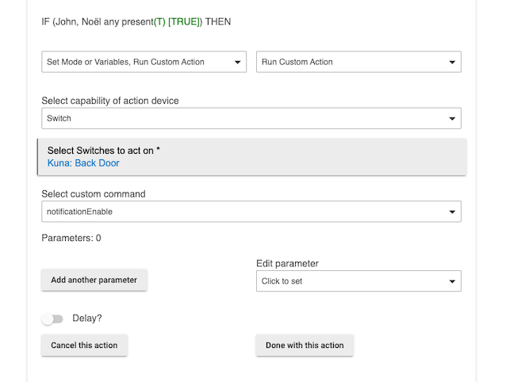
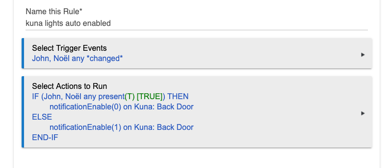

This report contains a app and driver to enable the use of Kuna lights within hubitat.

There are two things that you can do with the devices once they are installed.

1.  You can turn the light on or off.  This works much like any other switch you have in hubitat.  The important difference is unlike a local zwave switch where you get status updates as it turns on and off this driver has to poll Kuna to get the status so there is no real ability to detect when the light goes on or off (no big deal in my mind)
2.  You can enable 'notifications' on the phone.   This is accomplished by settin the notificationEnable command to 1 (enable notifications) or 0 (no notificatinos).  This is crazy useful as you can disable notifications when you are home and enable them when you are gone (this works pretty well) -- I subscribe to their AI system and it's pretty good about only alerting you when it sees people or cars.

# How to install ##

1.  Install the app and driver
2.  Run the app and enter crednentials
3.  Profit. App should add the devices in your account 

## Instructions for how to enable/disable notifications (on your phone, from kuna) using the notificationEnable command. ##

1.  It's important to realize that notificationEnable is a global across all lights -- you just need to set it one of your lights and it effects all of your lights.  In this example I pick a specific one even though I have 4 lights -- Setting in one light enables/disables it across your account.
2.  In rule machine set up a rule for presence changed on the pople who matter in your rule that triggers off 'changed'.  I use life360 for a presence detection and find it works really well.

3.  Make a 'if present' rule that if anyone in your list is present sets the globalNotification custom action to 0 (to disable the notification on your phone of alerts) - This prevents you from getting notificatinos as people walk around outside when you are sitting inside your house (presumably you don't need to get them if you are home anyway)
4.  Make a else condition that sets notificationEnable to 1 as shown below.  Your final rule should look something like this.
 

# Important things that this driver does not do #

*  It's not really useful for triggering events as you have to poll to get the light status (and the device won't poll on it's onwn)  
*  There is no way to have a kuna light be a notification/trigger in hubitat.   Use the kuna app for notifications and my 'enable/disable' trick above for a pretty reasonable solution for that
*  there are dozens of options for kuna lights (schedules, brightness, sounds) that this doesn't do.  Again use the kuna app for those.

